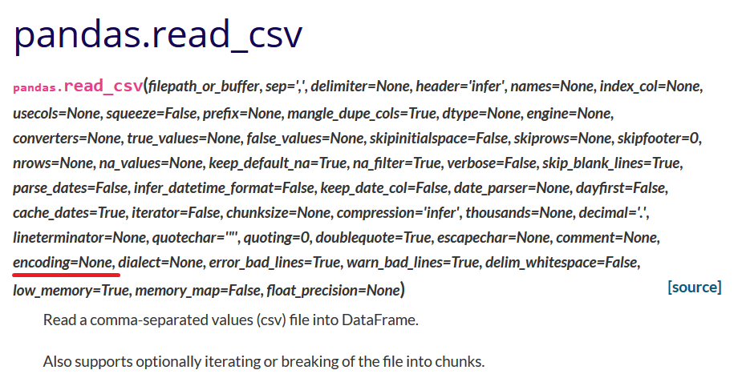
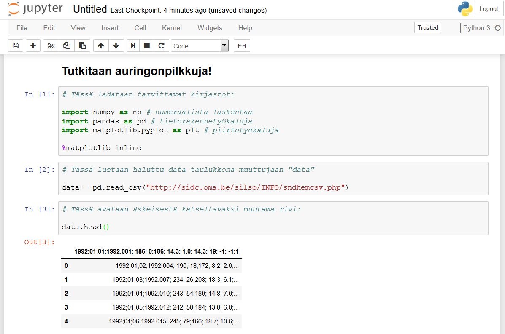

# Tiedostomuodoista

Jokainen tietokoneiden kanssa toiminut tietää, että informaatiota voidaan siirtää ja esittää useissa muodoissa. Lyhenteet kuten pdf, txt, ppt, rtf, jpg ja monet muut vilisevät niin arkisessa kuin ammatillisessakin käytössä. Kullakin näistä on oma tarkoituksensa, mutta samalla se estää niiden käyttöä toisissa yhteyksissä ilman muodon vaihtoa.

Ohjelmointia varten kannattaa suosia simppeleitä lista- tai taulukkomuotoisia tiedostoja, jotka ovat ns. koneluettavia. Esimerkiksi pdf-tiedostot sopivat hyvin ihmissilmille, mutta tietokoneet suosivat csv:n (comma separated values, pilkulla erotellut arvot) kaltaisia tekstilistauksia ja moni dataa jakava lähde jakaakin tietojaan näissä muodoissa. Vähäisen graafisen informaationsa vuoksi ne ovat usein myös tietokoneen muistin kannalta kevyitä ja kykenevät sisältämään suuria määriä dataa. Tällä sivulla käsitellyt harjoitteet käyttävät ensisijaisesti csv-tiedostoja.

### Erottimet

Pilkun sijaan tiedostossa voitaisiin käyttää erottimena sarkainta, puolipistettä tai muita symboleja. Joskus tiedoston lukeminen ohjelmaan ei onnistu, koska erotusmerkki on väärä. Tämä on useimmiten helppoa korjata tarkistamalla mitä merkkiä on käytetty ja vaihtamalla funktion erotusparametri vastaavaksi. Esimerkiksi Python 3 -kielessä pandas.read_cvs -komennon oletusasetus on sep = ",", minkä voisi vaihtaa vaikkapa muotoon sep = ";" jos kyseessä olisikin puolipiste. Tarkempi listaus löytyy komennon [dokumentaatiosta.](https://pandas.pydata.org/pandas-docs/stable/reference/api/pandas.read_csv.html)

Yllä näkyviä parametrejä ei tarvitse yleensä käsitellä tai edes nähdä koodaillessaan, mutta niitä voi halutessaan kutsua ja muokata.

### Merkistöt

Toinen yleinen kompastuskivi on se, millä merkistöllä tiedot on koodattu. Tämä määrittää miten bittijonot tulkataan kirjaimiksi tai merkeiksi ja vaihtelee alueittain ympäri maapalloa. Suomessa käytetään yleensä joko yleistä utf8-systeemiä tai pohjoismaista ISO-8859 -merkistöä. Täyden listan standardimerkistöistä löydät [dokumentoituna täältä.](https://docs.python.org/3/library/codecs.html#standard-encodings)

<!-- #region -->

# Esimerkkitapaus datan lataamisesta ja käsittelystä

Tehdään helppo esimerkki!

- Etsitään aineistoa, kuten vaikka aikasarja auringonpilkuista [SIDC:n sivuilta](http://sidc.oma.be/silso/datafiles).
- Tehdään muistio joka pystyy avaamaan sen:

- Lukeminen näyttää alkaneen huonosta kohtaa, käsketääs tulokseen mukaan otsikkorivi:

- No ei nyt ihan mennyt putkeen tämäkään, mutta huomaamme että syynähän on huonosti muotoiltu taulukko. Oletuserotin pd.read_csv() -komennolle on pilkku, mutta datassa näkyy puolipisteitä. Korjataan parametrilla "sep":

- Parempi. Nyt voi tietysti ihmetellä saisiko sarakkeet nimettyä paremmin, jos katsoo mitä kukin tarkoittaa (selitys SIDC:n sivuilla). Käytetään "names"-parametria latauksen yhteydessä. Voisi nämä nimetä muuttujassakin, mutta samalla vaivalla se pienillä tiedostoilla menee tässäkin.

- No johan alkaa näyttää ymmärrettävältä informaatiolta! Otetaan nopea kuvaaja pohjoisen ja eteläisen auringonpuoliskon pilkkuluvuista:

- Hahaa, voiton puolella. Tehdään vielä joukko muotoilutoimenpiteitä paremman esityksen nimissä:

Ja siinä se sitten onkin. Haettiin dataa, katsottiin millaista se on, muotoiltiin se nätimmäksi ja esitettiin se kivana visualisaationa josta voidaan ryhtyä pureutumaan vaikka auringon monivuotisiin sykleihin tai jatkaa tarkemmin itse datan kanssa (selvitetään vaikka keskimääräiset päivittäiset pilkkumäärät ja niiden vuosittaiset vaihtelut).

Kokeile itse samaa luomalla uusi muistio ja etsimällä kiintoisa datasetti (tai kopsaa osoite yltä)!
<!-- #endregion -->
