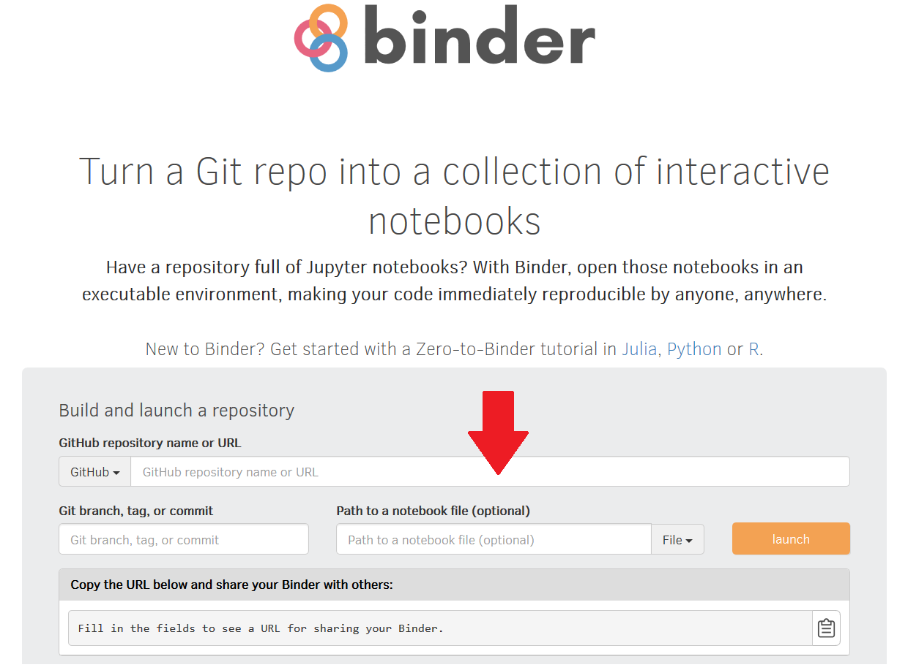
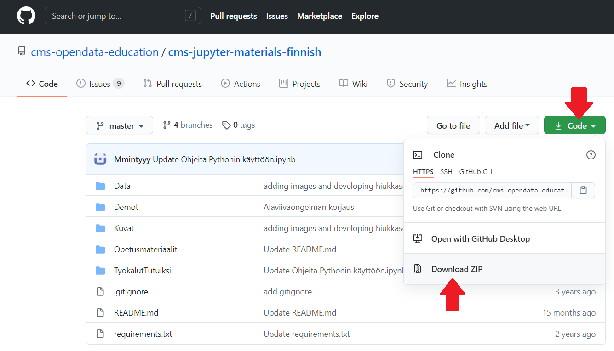
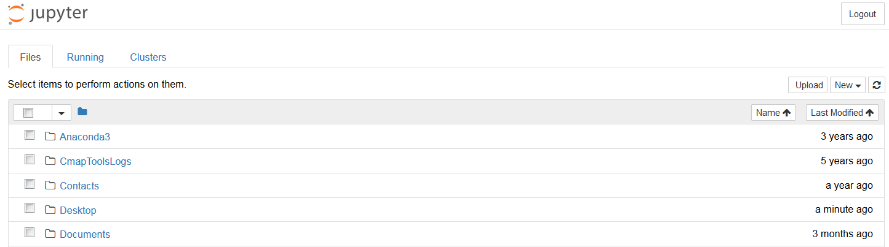

# Jupyter Notebook

Jupyter Notebook on avoimen lähdekoodin työkalu, joka on syntynyt IPythonin pohjalta osana [Project Jupyteria](https://jupyter.org/) vuonna 2014. Niitä voi luoda, käsitellä ja muokata sekä omalla koneellaan että verkon ylitse.

Notebookien vahvuudet ovat opetustoimen tarpeisiin mitä parhaimmat. Ei erityisempää asennushäslinkiä, ei raskasta kehitystyöympäristöä, jakaminen ja muokkaaminen on helppoa, jatkuva kyky ajaa ja muokata yksittäisiä paloja koodissa, systeemiä ei ole sidottu mihinkään tiettyyn aiheeseen ja niin edelleen. Tarjottujen harjoitteiden pohjalta opettajien on helppoa lähteä luomaan omia materiaalejaan.

Kyseessä on verkkoselainkäyttöinen, JSON-pohjainen muistio, jossa voidaan yhdistää näppärästi ja vuorovaikutteisesti niin kuvia, tekstiä kuin koodiakin. Muistio on tyyppiä IPYNB (IPython Notebook), mutta tallentuu esittelyä varten helposti vaikkapa HTML- tai PDF-muodossa. Muistio itse on ohjelmointikielen suhteen neutraali pohja, mutta siihen liitetään sopiva ydin (kernel), joka ymmärtää haluttua kieltä. Project Jupyter alkoi pääasiassa Julian, Pythonin ja R-kielen ympäristönä, mutta nykyisellään sitä voi käyttää kymmenillä muillakin. Tällä sivulla keskitytään Pythoniin.

## Jupyter Notebookien käyttöönotto

Jupyter Notebookeja voi käsitellä joko lokaalisti omalta tietokoneeltaan tai verkon yli selaimella virtuaalisella työtasolla.

Selaimessa ajettaessa ei tarvitse tehdä mitään latauksia ja materiaaleihin pääsee yleensä parissa minuutissa käsiksi, mutta tämä vaatii jatkuvaa verkkoyhteyttä ja on usein aikarajoitettua (MyBinder esimerkiksi irrottaa yhteyden, mikäli mitään laskentaa ei tehdä kymmeneen minuuttiin). Sopii hyvin esimerkiksi demoihin tai intensiiviseen työpajatoimintaan, mutta pidempiä projekteja varten kannattaa suosiolla ladata koneelleen sopiva sovellus tätä varten.

### 1. Pikaohje selaimessa avaamiseen

#### MyBinder

I Etsi sopivan muistion tai GitHub-repon osoite, esim. [https://github.com/cms-opendata-education/cms-jupyter-materials-finnish/blob/master/Demot/Hiukkasfysiikkaa/Higgs-hakusessa-4-leptonia.ipynb](https://github.com/cms-opendata-education/cms-jupyter-materials-finnish/blob/master/Demot/Hiukkasfysiikkaa/Higgs-hakusessa-4-leptonia.ipynb)

II Avaa [MyBinder](https://mybinder.org), joka rakentaa virtuaalisen työtilan. Sivu näyttää suunnilleen tältä:

III Kopioi ensimmäisen kohdan osoite kenttiin, joko pelkkä [https://github.com/cms-opendata-education/cms-jupyter-materials-finnish](https://github.com/cms-opendata-education/cms-jupyter-materials-finnish) (rakentaa koko repon ja avaa puurakenteen) tai suoraan tiedostoon paloittelemalla linkki tähän tapaan:

 

IV Paina "launch" ja odota hetki.

V Käy hommiin!

VI Opetushommia ajatellen, huomaa kuvan alaosassa näkyvä valmiiden materiaalien jakolinkki joka on helppoa upottaa verkkosivuille tai viesteihin niin että opiskelijat pääsevät suoraan töihin yhdellä klikkauksella. Esimerkiksi äskeisen harjoitteen saa Binderilla auki tästä HTML-napista painamalla:

#### Google Colab

I Etsi sopiva tiedosto, käytetään samaa kuin yllä (teknisesti haetaan myöhemmin, mutta tietäminen helpottaa löytämistä).

II Avaa [Colab](https://colab.research.google.com/notebooks/intro.ipynb).

III Paina vasemmalta ylhäältä "File"-valikosta "Open Notebook".

IV Avaa "GitHub" -välilehti ja hae haluamaasi repositoriota nimellä.

V Etsi listasta haluamasi tiedosto ja paina avausnappia oikealla:

VI Käy hommiin!
  
VII Sama juttu pikalinkkien kanssa, Colabiinkin voi viitata suoraan yhdellä klikkauksella:

### 2. Pikaohje omalla koneella toimimiseen

#### Materiaalien lataaminen

I Jos haluat käyttää materiaalipankkimme materiaaleja omalla koneellasi, sinun tulee ensin ladata ne [GitHub-sivultamme](https://github.com/cms-opendata-education/cms-jupyter-materials-finnish). Voit ladata kaiken sisällön kerralla zip-pakettina klikkaamalla nappia "Code" ja valitsemalla vaihtoehdon "Download ZIP":

II Pura zip-paketti haluamaasi kansioon tietokoneellesi.

#### Materiaalien käyttäminen

I Asenna koneellesi sopiva sovellus, kuten itse [Jupyter Notebook](https://jupyter.org/) tai laajempi datatieteen paketti kuten [Anaconda](https://www.anaconda.com/products/individual), jossa on aiempi mukana.

II Avaa äskeinen (Anacondan tapauksessa löytynee nimellä Anaconda Navigator).

III Valitse "Jupyter Notebook", joka avaa verkkoselaimeesi koneesi paikallisen puurakenteen. 

IV Etsi tiedostoistasi haluamasi muistio ja käy töihin.

V Jos haluat tehdä uusia muistioita, navigoi itsesi puussa kansioon johon haluat tehdä uuden tiedoston ja paina "New" nappia.

