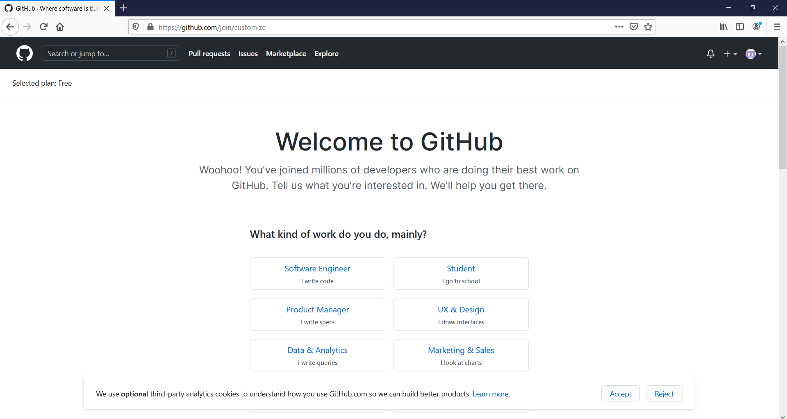
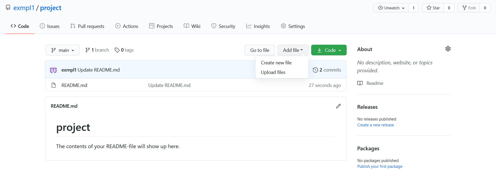

# Omien materiaalien laatiminen

Notebookit ovat helppokäyttöisiä työkaluja: pohjimmiltaan muistio koostuu soluista, joille voi valita joko teksti- tai koodistatuksen. Näitä lisäämällä ja muotoilemalla voi kirjoittaa omia materiaalipohjiaan ties minkä aineistojen analysointiin.

Jupyter Notebookien perusilme näyttää tältä (MyBinderissa on natiivina sama):

Soluja pääsee muokkaamaan kaksoisklikkaamalla ja niiden sisällön ajaminen ytimen kautta onnistuu joko työkalurivin **"Run"**-painikkeesta tai suoraan näppäimistöltä painamalla **Ctrl+Enter**. Jos solu on valittu, sen ympärillä on sininen reunus, joka muuttuu vihreäksi muokkaustilassa.

Työkalurivin **"Help"**-valikosta (tai painamalla **"h"** ilman soluvalintaa) löytyy lista pikanäppäimistä.

Solujen vasemmalla puolella näkyvissä sulkeissa on järjestysnumero, joka kertoo missä vaiheessa kyseinen solu on ajettu. Mikäli siinä näkyy tähti (**\***), solua ajetaan yhä. Joskus ajo kestää pitkään, esimerkiksi animaatioita tai isoja latauksia tehdessä, mutta jos näin ei pitäisi olla kyseisessä koodissa on todennäköisesti loppumaton silmukka joka pitää keskeyttää **"Kernel"**-valikon kautta keskeyttämällä ajo **"Interrupt"**-käskyllä.

Välillä voi myös käydä niin, että ytimeen on jäänyt sotkuinen muuttuja joka aiheuttaa virheitä myöhemmissä komennoissa. Tällöin voi olla aiheellista ajaa määrittelevät solut uudelleen tai tyhjentää kaikki **"Kernel"**-valikon **"Restart"**-käskyillä (joilla voi myös pyyhkiä aiemmat tulokset tai ajaa alusta lähtien koko muistion kerralla yksittäisten solujen napsuttelun sijaan). Ytimen uudelleenkäynnistys tai keskeytys ei vaikuta millään tapaa muistion muotoiluun tehtyihin toimiin, vain kullakin hetkellä muistissa oleviin tuloksiin, muuttujiin ja vastaaviin olioihin.

## GitHub

Itse tehtyjen Notebookien jakaminen opiskelijoille onnistuu kätevästi esimerkiksi tallentamalle ne [GitHubiin](https://github.com/), kuten materiaalipankkimme demomateriaalit. Tällä sivulla opastamme GitHubiin rekisteröitymisessä ja alkuun pääsemisessä.

GitHub on suosittu työkalu, joka mahdollistaa muun muassa nettisivujen hostauksen ja koodiprojektien kätevän versionhallinnan silloinkin, kun useampi ihminen muokkaa samaa koodia. Sitä käytetään esimerkiksi ohjelmistojen ja nettisivujen lähdekoodin tallentamiseen. GitHubissa projekteja voi tallentaa repositorioihin eli ohjelmavarastoihin. Julkiseksi määritellyn repositorion sisältämä koodi, tiedostot ja niiden muutoshistoria ovat avoimesti kenen tahansa saatavilla. Tämä tekee materiaalin jakamisesta helppoa, ja kuka tahansa kiinnostunut voi näin perehtyä ohjelmistokoodin toimintaperiaatteisiin. Esimerkiksi [Koronavilkku-sovelluksen lähdekoodi](https://github.com/THLfi) on julkaistu GitHubissa.

GitHubiin rekisteröityminen on ilmaista, ja voit tehdä sen [GitHubin etusivulla](https://github.com/) valitsemalla itsellesi käyttäjänimen ja syöttämällä käyttämäsi sähköpostin sekä haluamasi salasanan.

Tietojen syöttämisen jälkeen sivusto pyytää sinua vahvistamaan tunnuksen luomisen, minkä jälkeen pääset oman GitHubisi etusivulle. Sen pitäisi näyttää suurinpiirtein tältä:

Aloitetaan luomalla uusi repositorio. Tämän voit tehdä oikeasta yläkulmasta löytyvästä painikkeesta. Huomaathan, että ennen kuin voit luoda repositorion, sinun tulee käydä vahvistamassa sähköpostiosoitteesi klikkaamalla vahvistuslinkkiä GitHubin lähettämästä sähköpostista.

Luodessasi repositoriota sen omistajana näkyy käyttäjänimi, jolla olet kirjautunut GitHubiin (esimerkkikuvassa _exmpl1_). Voit valita repositroirolle kuvaavan nimen ja päättää, onko projektisi julkinen vai yksityinen. Jos tarkoituksenasi on jakaa materiaaleja esimerkiksi oppitunneilla, simppeleintä on tehdä repositoriosta julkinen. Tämän lisäksi kannattaa lisätä repositorioon README-tiedosto, jonka sisältö näkyy repositoriosi aloitussivulla ja jonne voit kirjoittaa ohjeita repositorion käyttäjälle. Jos haluat, että muut voivat muokata ja soveltaa avoimia materiaalejasi, kannataa perehtyä repositorioiden [lisensointiin](https://docs.github.com/en/free-pro-team@latest/github/creating-cloning-and-archiving-repositories/licensing-a-repository). Oletuksena GitHubiin ilman erillistä lisenssiä tallennettu materiaali on suojattu tekijänoikeuksin.

Kun olet klikannut painiketta "Create repository", sinulle pitäisi avautua näkymä uuteen repositorioosi:

Wuhuu, ensimmäinen GitHub-repositoriosi on nyt luotu! Pääset luomaan tai lataamaan olemassa olevia tiedostoja klikkaamalla "Add file" ja valitsemalla "Create new file" tai "Upload files". Voit haluteassasi luoda kansion tiedostollesi kirjoittamalla uutta tiedostoa luodessasi sen nimen alkuun haluamasi kansion nimen ja sen perään kauttaviivan / ennen itse tiedoston nimeä.

Sitten vain luomaan Jupyter Notebookeja GitHubiin jaettavaksi!

## Oman Jupyter Bookin tekeminen

Jos haluat kokeilla oman Jupyter Bookin tekemistä, seuraa virallista ohjetta osoitteessa [https://jupyterbook.org/start/overview.html](https://jupyterbook.org/start/overview.html).
